# 탁구공 검출 프로젝트

:heavy_check_mark: : 채택한 방법  
<br>
<br>
## 학습
        
- 영상 **calibration** 값 선택
    - xycar 내부 코드 활용
        
        ```python
        camera_matrix_origin = np.array([[422.037858, 0.000000, 245.895397],
                        [0.000000, 435.589734, 163.625535],
                        [0.000000, 0.000000, 1.000000]])
        
        dist_coeffs_origin = np.array([-0.289296, 0.061035, 0.001786, 0.015238, 0.000000])
        ```
        
        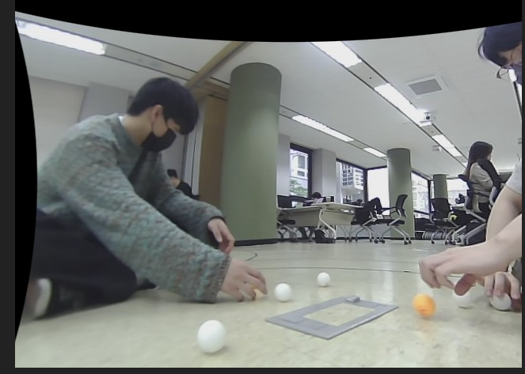
        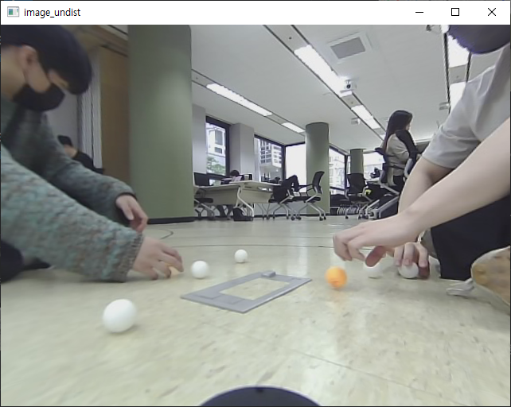
        
    - **체크보드**에서 직접 검출
        - 초기 20장으로 계산 :heavy_check_mark:
            
            ```python
            camera_matrix_origin = np.array( [[348.26309945, 0., 332.530534],
             [0., 347.36040435, 238.04691592], [0., 0., 1.]])
            
            dist_coeffs_origin = np.array( [-0.363409, 0.199566, -4.7e-05, -0.000814, -0.069992])
            ```
            
        - 외각부분이 덜 적용되서 10장 추가
            - camera_matrix = [352.746338, 0.000000, 336.254312, 0.000000, 352.404359, 239.397817, 0.000000, 0.000000, 1.000000]
            - 기존 20장은 외곽 부분이 미흡해서 체크보드를 외각부분과 화면에 꽉차는 사진을 추가했다.
            - 왼쪽은 기존 20장, 오른쪽은 10장을 추가한 사진이다. 성능이 향상되었다.
            - 다시 labeling 할 수 없어서 적용하진 못했다.
            
            
            
- **데이터 라벨링**
    - 두 탁구공의 색깔을 구분 : white ball, yellow ball
    - ball과 ignore 두 클래스로 구분 :heavy_check_mark:

- **YOLOv3 - tiny** 를 그대로 사용하자
(파이토치 변환은 시간상 힘들 것 같다)
    - 학습결과 : 
    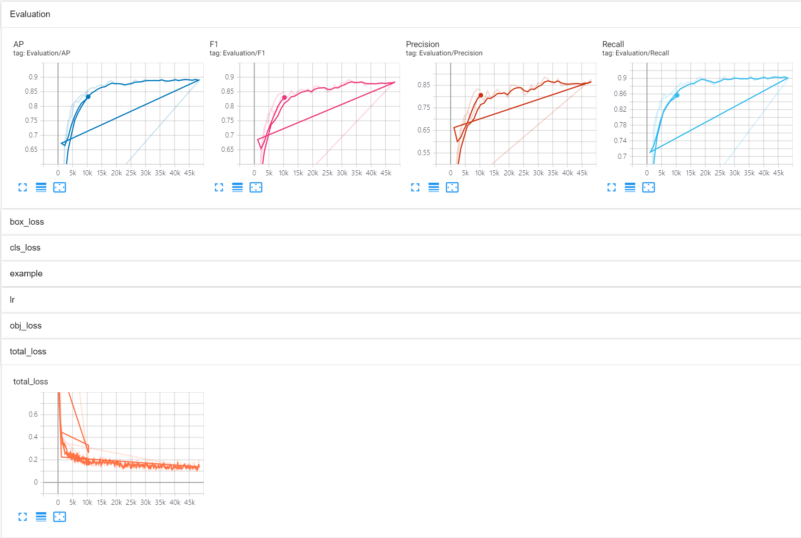
        
        

## 객체 위치 판단

### 거리 추정
   - ****Homography Distance Estimation**** ⇒ 추후 적용
   - ****Geometrical Distance Estimation**** :heavy_check_mark:
        - 카메라와 대상 객체의 기하학적 조건을 활용
            - 카메라 높이
            - 대상 객체가 3차원 공간에 존재하는 특수 조건
            - 원근변환
        - FOV 알아내기 : 횡방향 정보를 알기 위해 사용
            - 체크보드 20장
                - FOVx: 85.15642320910048
                - FOVy: 69.28313182755481
            - 체크보드 20 + 10장
                - FOVx: 84.42658489293875
                - FOVy: 68.51253227818162
       -  계산 <br>
            -  <br>
            -  <br>
            - Get a center pixel value in x axis <br>
             <br>
            - Get a y coordinate in normalized image plane <br>
             <br>
            <br>
             <br>
             <br>
            
             <br>
             <br>
             <br>
### 영상 변환
   - 딥러닝 결과 640x480 → 416x416 바뀜
   - 정확한 거리 측정을 위해 바운딩 박스를 다시 640x480에 맞춰줌
        - 640/416 , 480/416 곱하기 :heavy_check_mark:
            
            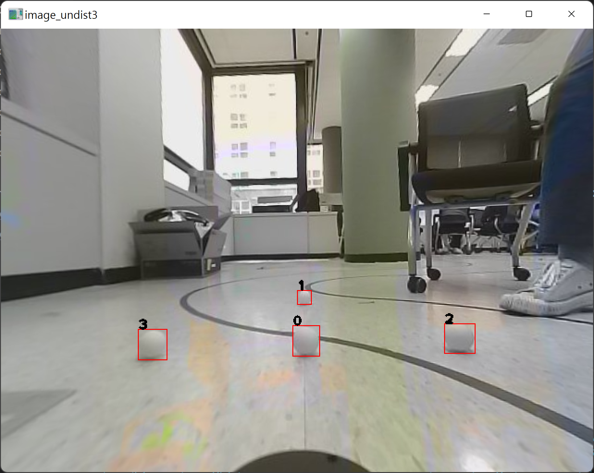
            
### 2D 객체 위치 그리기

   - 버드아이뷰
   - matplot
   - rivz
   - OpenCV :heavy_check_mark:

       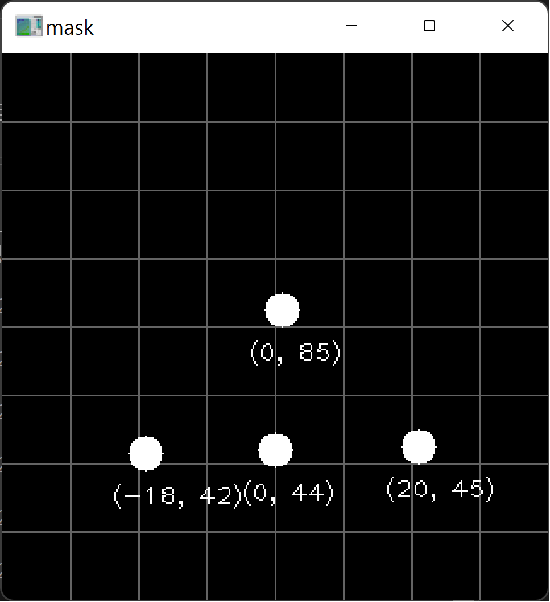
        
- Sensor Fusion ( USB cam + ? )
    - Lidar : 높이가 높아서 바닥의 탁구공을 검출하지 못함
    - depth camera : 굳이 카메라끼리 같이 사용 할 필요성이 낮아보임
    - ultra sonic : 센서 위치가 차량 후방에 위치함
    
    ⇒ 추후에 적용 해보기로 했음  
<br>
<br>

## 결과 확인

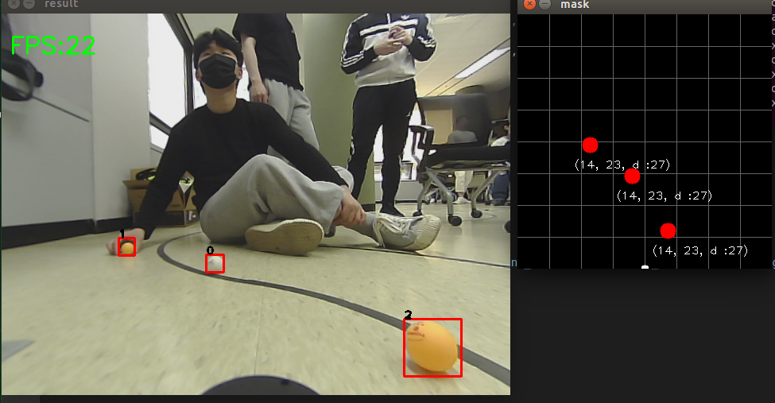
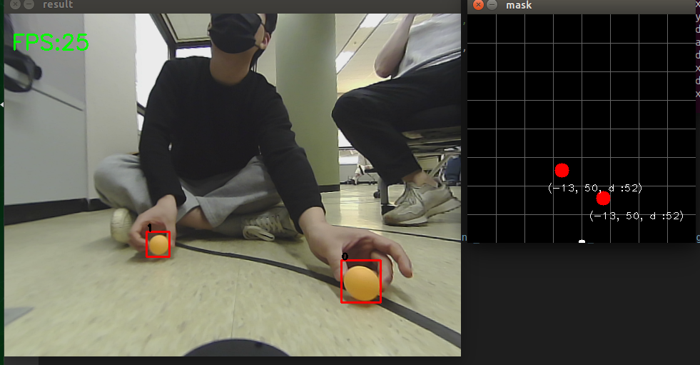
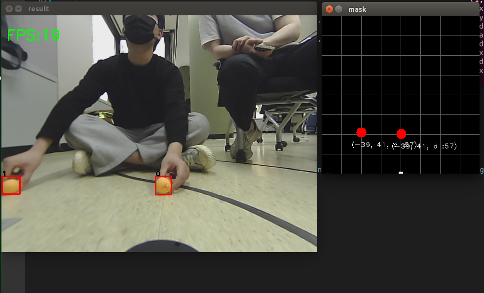  
  


- 제출 방식

    **[거리정보 정확도 확인]**
    
    - 최상원 멘토님이 준비해주신 이미지에서 확인할 수 있는 세 가지 객체(탁구공)의 x,y 거리 좌표 csv 파일
    
    **[객체 인식 정확도 확인]**
    
    - 추후 첨부된 score 파일에 작성된 (README.txt) 파일을 참조하여 객체인식 csv 결과 파일을 포맷에 맞춰 제출


## 탁구공 객체 인식 결과

기본 상태

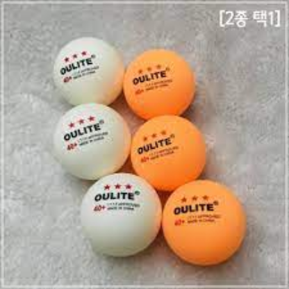   
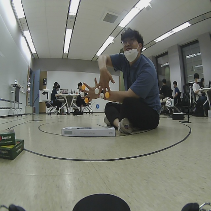   
   
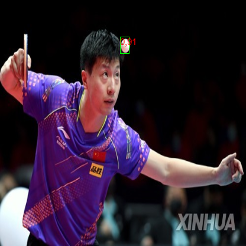   

시간상 빠르게 인식률을 높이기 위해 confidence만 낮춘 상태  

   
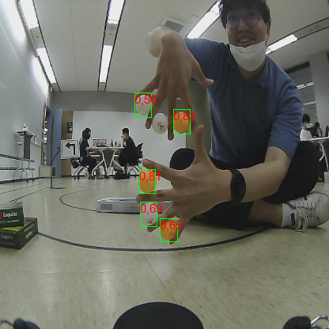   
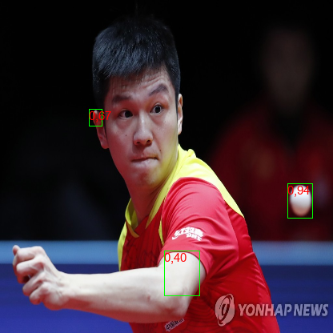   
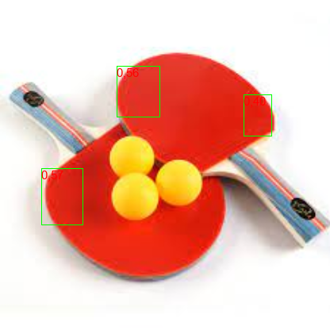   


## 등수 결과

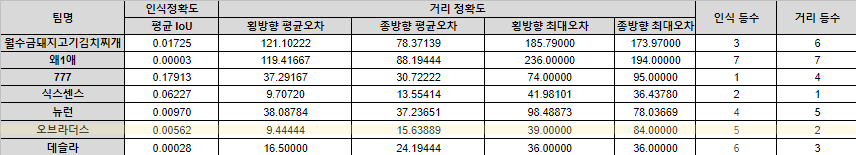   


인식등수 **5등**, 거리등수 **2등 👏👏**
